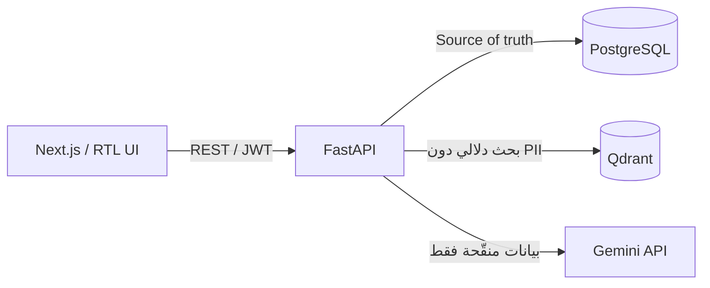

# Farah.event | فرح

منصة سورية للتوفيق الجاد بهدف الزواج، مبنية بمنهجية **الخصوصية أولًا**. ليست المنصة سوق ملفات شخصية ولا تطبيق مواعدة: الشاب يرى عدد فرص التوافق ومستواها العام فقط، بينما تبقى بيانات الفتيات الشخصية تحت إدارة خطّابات موثوقات وبعد الموافقات المطلوبة.

> رحلة تبدأ بثقة وتنتهي بفرح

## المعمارية



- `frontend/`: Next.js App Router وTypeScript وTailwind، ويشمل المسارات العامة وتدفقَي الشاب والفتاة ولوحتي الخطّابة والمدير.
- `backend/`: FastAPI مع بنية `Router → Service → Repository → Database`، وSQLAlchemy async وAlembic وRBAC وخدمات المطابقة وRAG والخصوصية.
- PostgreSQL هو **مصدر الحقيقة الوحيد**. Qdrant فهرس بحث دلالي قابل لإعادة البناء وليس مخزنًا للبيانات الخاصة.
- `docker-compose.yml`: يشغّل الواجهة والـAPI وPostgreSQL وQdrant، مع فحوص صحة واعتماد الخدمات على جاهزية بعضها.

## التشغيل السريع عبر Docker

المتطلبات: Docker Engine مع Docker Compose v2، وذاكرة متاحة مناسبة للخدمات الأربع.

```bash
cp .env.example .env
# غيّر JWT_SECRET وكلمات المرور، وأضف GEMINI_API_KEY عند استخدام الذكاء الاصطناعي الحقيقي
docker compose up --build -d
docker compose ps
docker compose exec backend alembic upgrade head
docker compose exec backend python -m app.database.seed
```

على PowerShell:

```powershell
Copy-Item .env.example .env
docker compose up --build -d
docker compose exec backend alembic upgrade head
docker compose exec backend python -m app.database.seed
```

بعد اكتمال فحوص الصحة:

- الواجهة: <http://localhost:3000>
- API: <http://localhost:8000>
- توثيق API في بيئة التطوير: <http://localhost:8000/docs>
- فحص صحة Backend: <http://localhost:8000/health>
- Qdrant للتشخيص المحلي فقط: <http://localhost:6333/dashboard>

قاعدة PostgreSQL غير منشورة على المضيف عمدًا. استخدم `docker compose exec postgres psql -U farah -d farah` للتشخيص. المنافذ المنشورة مرتبطة بـ`127.0.0.1` افتراضيًا ولا تصلح بذاتها للنشر العام.

لإيقاف الخدمات دون فقد البيانات:

```bash
docker compose down
```

لا تستخدم `docker compose down -v` إلا عند الرغبة الصريحة في حذف قاعدة البيانات وفهرس Qdrant المحليين.

## متغيرات البيئة

المرجع الكامل المشروح هو [`.env.example`](.env.example). أهم القيم:

| المجموعة | المتغيرات |
|---|---|
| التشغيل | `ENVIRONMENT`, `DEBUG`, `LOG_LEVEL`, `API_V1_PREFIX` |
| PostgreSQL | `POSTGRES_DB`, `POSTGRES_USER`, `POSTGRES_PASSWORD`, `DATABASE_URL` |
| التوثيق | `JWT_SECRET`, `JWT_ALGORITHM`, `JWT_ACCESS_EXPIRE_MINUTES`, `JWT_REFRESH_EXPIRE_DAYS` |
| AI | `GEMINI_API_KEY`, `GEMINI_CHAT_MODEL`, `GEMINI_EMBEDDING_MODEL` |
| Qdrant | `QDRANT_URL`, `QDRANT_API_KEY`, `QDRANT_COLLECTION` |
| المتصفح | `NEXT_PUBLIC_API_URL` |
| الحماية | `CORS_ORIGINS`, `RATE_LIMIT_PER_MINUTE` |
| Seed | `SEED_*_EMAIL`, `SEED_*_PASSWORD`, `SEED_DEFAULT_PASSWORD` |

ملاحظات مهمة:

- لا تضع أي سر في متغير يبدأ بـ`NEXT_PUBLIC_`؛ هذه القيم تصبح مرئية في حزمة المتصفح.
- ولّد `JWT_SECRET` للإنتاج بقيمة عشوائية قوية، مثل `openssl rand -hex 32`، ولا تستخدم قيم ملف المثال.
- عنوان `DATABASE_URL` و`QDRANT_URL` داخل Compose يستخدم اسمي الخدمتين `postgres` و`qdrant`. عند تشغيل Backend على المضيف استخدم `localhost` وخدمة بيانات متاحة له.
- غياب `GEMINI_API_KEY` يعني أن مزايا Gemini الحقيقية غير متاحة؛ لا ينبغي للنظام اختراع نتائج عند تعذر المزود.

## الحسابات التجريبية

يُنشئ seed بيانات اصطناعية وحسابات تطوير بالأسماء التالية:

| الدور | البريد الافتراضي | كلمة المرور |
|---|---|---|
| Super Admin | `admin@farah.local` | قيمة `SEED_ADMIN_PASSWORD` |
| Matchmaker | `matchmaker@farah.local` | قيمة `SEED_MATCHMAKER_PASSWORD` |
| Male User | `male@farah.local` | قيمة `SEED_MALE_PASSWORD` |

هذه الحسابات **للتطوير المحلي فقط**. امنع تشغيل seed واحذف/غيّر هذه الحسابات في staging والإنتاج. جميع أرقام الهواتف والملفات المزروعة يجب أن تكون اصطناعية.

## التطوير دون Docker

يمكن تشغيل طبقتي التطبيق على المضيف بعد توفير PostgreSQL وQdrant وتعديل العناوين في `.env`.

Backend (Python حديث):

```bash
cd backend
python -m venv .venv
# Linux/macOS: source .venv/bin/activate
# PowerShell: .venv\Scripts\Activate.ps1
pip install -r requirements.txt
alembic upgrade head
uvicorn app.main:app --reload --port 8000
```

Frontend (Node.js LTS):

```bash
cd frontend
npm install
npm run dev
```

إذا كان المشروع يستخدم ملف قفل، استخدم `npm ci` في CI بدل `npm install` لضمان تثبيت متكرر النتائج.

## Migrations والبيانات التجريبية

```bash
# تطبيق جميع migrations
docker compose exec backend alembic upgrade head

# عرض النسخة الحالية
docker compose exec backend alembic current

# إنشاء migration بعد تعديل النماذج (راجعه يدويًا قبل الدمج)
docker compose exec backend alembic revision --autogenerate -m "describe change"

# التراجع Migration واحدة في بيئة تطوير فقط
docker compose exec backend alembic downgrade -1

# Seed تطويري قابل للتكرار
docker compose exec backend python -m app.database.seed
```

يجب تطبيق migrations كخطوة إصدار منفصلة ومراقبة قبل تحويل حركة الإنتاج، مع نسخة احتياطية وخطة رجوع. لا تشغّل `--autogenerate` آليًا في الإنتاج.

## الاختبارات والتحقق

```bash
# Backend + RAG + privacy tests
docker compose exec backend pytest

# Frontend
docker compose exec frontend npm run lint
docker compose exec frontend npm run typecheck
docker compose exec frontend npm test

# Production builds
docker compose build backend frontend
```

أو على Linux/macOS/WSL استخدم الاختصارات:

```bash
make test
make build
make verify
```

قبل الإصدار يجب أن تشمل التغطية: authentication وتدوير refresh token، RBAC، منع أكثر من طلب فعّال للشاب، CRUD لملفات الفتيات، المطابقة المتبادلة، انتقالات الدفع والحالات، audit logs، واختبار عدم تسرب `phone/email/full_name/exact_address/private_notes` إلى Qdrant أو Gemini أو استجابة الشاب.

## قواعد الخصوصية والأمان

- لا تعرض API أو الواجهة أي اسم أو هاتف أو بريد أو عنوان أو صورة لفتاة إلى مستخدم شاب.
- يمر المحتوى عبر `PrivacySanitizerService` قبل Gemini وQdrant وأي استجابة للشاب. لا تُرسل الحقول الخاصة إلى logs كذلك.
- يخزن Qdrant النص العام المنقح ومعرّفًا تقنيًا فقط؛ استرجاع السجل النهائي والصلاحيات يتمان من PostgreSQL.
- المطابقة متبادلة الاتجاهين وتتطلب تجاوز الحد الأدنى القابل للتعديل للطرفين. النموذج اللغوي لا ينشئ ملفات ولا يُعد مصدر حقيقة.
- الحماية في الواجهة (إخفاء زر أو مسار) ليست تفويضًا؛ كل endpoint حساس يتحقق من الدور والصلاحية في Backend ويسجّل العمليات الحساسة في audit log.
- استخدم HTTPS وSecure/HttpOnly/SameSite cookies عند اعتماد cookies، وحدود طلبات، وCORS صريحًا، وسياسة أسرار خارج المستودع في الإنتاج.
- دوّر مفاتيح JWT وGemini وكلمات مرور قاعدة البيانات دوريًا. لا تحفظ الرموز أو PII في سجلات CI أو تقارير الأخطاء.
- ملفات `.env` مستبعدة من Git. ملف `.env.example` قالب فقط ولا يحتوي أسرارًا صالحة.

## ملاحظات النشر الإنتاجي

ملف Compose مخصص للتطوير/التقييم المحلي. للنشر الفعلي:

1. ابنِ صورًا ثابتة بإصدارات أو digests ولا تستخدم أسرار build-time.
2. ضع reverse proxy أو load balancer مع TLS أمام الواجهة والـAPI، ولا تنشر PostgreSQL أو Qdrant للعامة.
3. استخدم خدمة أسرار ومدير قاعدة بيانات ونسخًا احتياطية مشفرة ومختبرة الاستعادة.
4. اضبط `ENVIRONMENT=production` و`DEBUG=false` وCORS على النطاق الحقيقي، وعطّل Swagger العام إن لم يكن مطلوبًا.
5. شغّل migrations بإجراء إصدار مراقب، ثم افحص `/health` والسجلات والـmetrics قبل تمرير الحركة.
6. طبّق retention وحذف البيانات وحقوق الوصول وفق السياسة القانونية المحلية، وراجع أثر إرسال البيانات إلى مزودي AI خارجيين.

## أوامر مفيدة

```bash
docker compose logs -f backend frontend
docker compose ps
docker compose restart backend frontend
docker compose exec backend pytest -q
docker compose exec postgres pg_isready -U farah -d farah
curl http://localhost:8000/health
```

عند بقاء خدمة `unhealthy` ابدأ بـ`docker compose logs <service>`، وتحقق من تطابق كلمات مرور PostgreSQL و`DATABASE_URL` ومن صلاحية مفتاح Gemini. تغيير بيانات PostgreSQL بعد إنشاء volume لا يغير المستخدم المخزن تلقائيًا؛ عالج ذلك عبر migration/SQL أو أعد إنشاء volume محليًا فقط إذا كان فقد البيانات مقبولًا.
